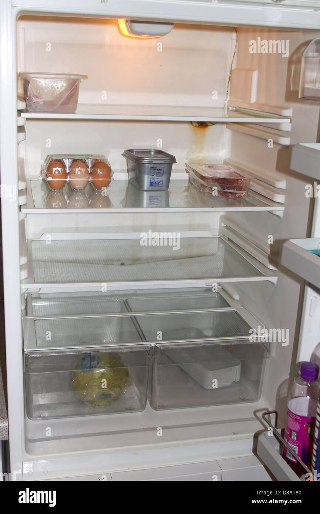

# 🍳 Recipes Agent — "what can I cook with this?"

A multimodal LangChain agent that takes a **photo of your fridge**, works out what's in it,
searches the live web for real recipes, and comes back with a short list you can actually cook.

Built with LangChain 1.x `create_agent` (LangGraph under the hood), Claude Haiku 4.5, Tavily
web search, and a self-hosted **Langfuse** stack for tracing every run.

---

## Demo

Input — `examples/test.jpg`, an ordinary photo of an open fridge:



The agent sees eggs, raw meat, a plastic tub and some greens, searches the web for recipes
that use them, and answers with something like:

> Based on what I can see in your fridge — eggs, minced/diced meat, and lettuce:
>
> 1. **Meat & Egg Skillet** — everything in one pan, served over the lettuce. ~20 min.
> 2. **Meatball Lettuce Wraps** — uses the meat and lettuce; you'd need breadcrumbs. ~30 min.
> 3. **Egg Fried Rice with Meat** — quick and filling, but needs cooked rice you didn't show.
>
> Want the full recipe for one of these?

Ask for *"the first one"* and it searches the web again — specifically for that recipe — before
giving step-by-step instructions.

---

## How it works

```
 photo (base64)                                   ┌──────────────┐
      +           ──►  HumanMessage  ──►  Agent  ─┤ web_search   │──►  Tavily API
 "what can I make?"     (multimodal)     (Claude) └──────────────┘
                                            │
                                     InMemorySaver          every step streamed
                                     (thread_id = "1")  ──────────────────────►  Langfuse
                                     short-term memory                          (self-hosted)
```

| Piece | Choice | Why |
|---|---|---|
| Agent loop | `langchain.agents.create_agent` | ReAct-style tool loop on LangGraph, no hand-rolled orchestration |
| Model | `claude-haiku-4-5`, `temperature=0.3` | Vision-capable, cheap and fast enough for an interactive loop |
| Tool | Tavily `web_search` | Search results already formatted for LLM consumption |
| Memory | `InMemorySaver` + `thread_id` | Follow-ups like *"give me the recipe for the first one"* resolve against history |
| Vision input | `HumanMessage` with `{"type": "image", "base64": ..., "mime_type": ...}` | Content-block format of LangChain 1.x |
| Tracing | Langfuse v3, self-hosted | Full local observability with no data leaving the machine |

### Details worth pointing at

**Forcing the search.** The interesting engineering here isn't the graph — it's the prompt.
A recipe model will happily answer from memory, which produces plausible recipes that nobody
published. The system prompt makes the web search non-negotiable: a rule at the top, a
numbered protocol, three few-shot examples that all show a search call, and a closing
reminder. It also forbids claiming a search happened when it didn't, and requires a *second*
search when the user asks for full instructions of a specific recipe.

**MIME sniffing by magic bytes.** Browser file uploads through `ipywidgets.FileUpload` don't
carry a reliable content type, so the notebook reads the file signature (`\xff\xd8\xff` → JPEG,
`\x89PNG\r\n\x1a\n` → PNG, `RIFF....WEBP` → WebP, …) instead of trusting the filename.

**Tracing without touching call sites.** [`recipes_agent/tracing.py`](recipes_agent/tracing.py)
registers the Langfuse handler through LangChain's `register_configure_hook`, so every
`.invoke()` in the process is traced without passing `config={"callbacks": [...]}` anywhere.
Passing `CallbackHandler` as the handler class means an explicitly-supplied handler wins and
runs are never double-traced. `LANGFUSE_TRACING=false` turns the whole thing off without a
code change.

---

## Project structure

```
recipes-agent/
├── recipes_agent/
│   ├── main.ipynb        # the agent: tools, prompt, multimodal invoke
│   └── tracing.py        # global Langfuse handler + flush()
├── examples/
│   └── test.jpg          # sample fridge photo used in the demo
├── docker-compose.yml    # self-hosted Langfuse v3 (6 services)
├── .env.example          # every variable the project reads
├── env_utils.py          # environment sanity checker
└── pyproject.toml
```

---

## Setup

**Requirements:** Python ≥3.12 <3.14, [uv](https://docs.astral.sh/uv/), Docker (only for tracing).

```bash
git clone <repo-url> && cd recipes-agent
uv sync
cp .env.example .env     # then fill in the keys
```

Keys you actually need for the agent:

| Variable | Where to get it |
|---|---|
| `ANTHROPIC_API_KEY` | [console.anthropic.com](https://console.anthropic.com) |
| `TAVILY_API_KEY` | [tavily.com](https://tavily.com) — generous free tier |

Everything else in `.env.example` belongs to the optional Langfuse stack.

### Tracing (optional)

```bash
openssl rand -base64 32      # generate NEXTAUTH_SECRET and SALT
docker compose up -d         # Langfuse on http://localhost:3000
```

Sign up in the local Langfuse UI, create a project, copy the public/secret keys into
`LANGFUSE_PUBLIC_KEY` / `LANGFUSE_SECRET_KEY`. To skip all of this, set
`LANGFUSE_TRACING=false` — the notebook runs fine without it.

Langfuse v3 needs Postgres + ClickHouse + Redis + S3-compatible storage; none of them are
optional, which is why the compose file has six services. Two images are pinned deliberately:
MinIO comes from quay.io (Docker Hub's copy now requires auth) and ClickHouse is pinned to
`25.3` (the `latest` tag shipped a 0-byte entrypoint).

### Run

```bash
uv run jupyter lab
```

Open [`recipes_agent/main.ipynb`](recipes_agent/main.ipynb) and run the cells top to bottom.
The upload widget cell renders a file picker — drop in `examples/test.jpg` (or a photo of your
own fridge), then run the rest.

---

## Known issues

- **`Media upload error: [Errno 11001] getaddrinfo failed`** on `flush()`. Traces themselves
  are fine; only the image attachment fails to upload. The SDK is handed the container-internal
  MinIO endpoint (`http://minio:9000`), which the host can't resolve. Publishing MinIO's port
  and pointing `LANGFUSE_S3_MEDIA_UPLOAD_ENDPOINT` at `localhost:9000` fixes it.
- `InMemorySaver` means conversation history dies with the kernel — fine for a notebook, not
  for anything deployed.

## Possible next steps

- Swap `InMemorySaver` for a persistent checkpointer (SQLite/Postgres).
- Extract the notebook into a LangGraph app and serve it behind a small chat UI.
- Structured output for suggestions (name / time / missing ingredients) instead of free-form Markdown.
- An eval set of fridge photos scored on ingredient-recognition accuracy and whether a search
  actually happened.

## Credits & license

The repository scaffolding (`pyproject.toml`, `env_utils.py`, virtualenv setup) started from
[LangChain Academy's *Introduction to LangChain*](https://academy.langchain.com/courses/foundation-introduction-to-langchain-python)
course template. The agent, the prompt, the multimodal image pipeline and the Langfuse
tracing setup are mine.

MIT — see [LICENSE](LICENSE).
